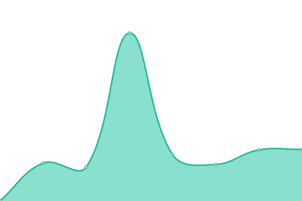
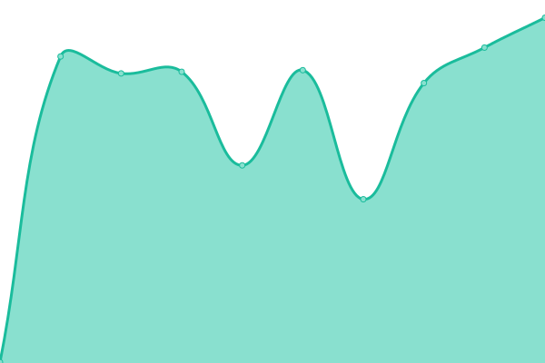
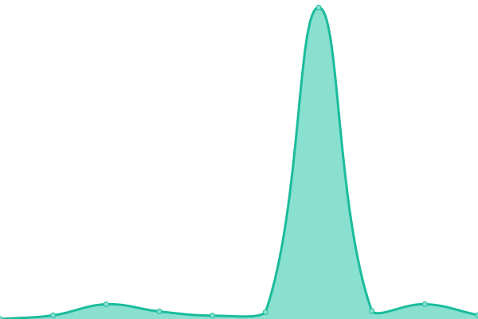

# [📈 Live Status](https://releen.github.io): <!--live status--> **🟧 Partial outage**

This repository contains the open-source uptime monitor and status page for [Pivotal](https://pivotal.io/), powered by [Upptime](https://github.com/upptime/upptime).

With [Upptime](https://upptime.js.org), you can get your own unlimited and free uptime monitor and status page, powered entirely by a GitHub repository. We use [Issues](https://github.com/pivotal/upptime/issues) as incident reports, [Actions](https://github.com/pivotal/upptime/actions) as uptime monitors, and [Pages](https://pivotal.github.io/upptime) for the status page.

<!--start: status pages-->
<!-- This summary is generated by Upptime (https://github.com/upptime/upptime) -->
<!-- Do not edit this manually, your changes will be overwritten -->
<!-- prettier-ignore -->
| URL | Status | History | Response Time | Uptime |
| --- | ------ | ------- | ------------- | ------ |
|  [RelEng Concourse](https://releng.ci.cf-app.com) | 🟩 Up | [rel-eng-concourse.yml](https://github.com/releen/upptime/commits/HEAD/history/rel-eng-concourse.yml) | 

 298ms
     
 | 

<a href="https://upptime.ppxp.team/history/rel-eng-concourse">100.00%</a>
    

|  [TR2 Concourse](https://ci.prs.releng.rocks) | 🟥 Down | [tr-2-concourse.yml](https://github.com/releen/upptime/commits/HEAD/history/tr-2-concourse.yml) | 

 0ms
     
 | 

<a href="https://upptime.ppxp.team/history/tr-2-concourse">100.00%</a>
    

|  [Upgrade Planner](https://upgrade-planner.pivotal.io) | 🟩 Up | [upgrade-planner.yml](https://github.com/releen/upptime/commits/HEAD/history/upgrade-planner.yml) | 

 339ms
     
 | 

<a href="https://upptime.ppxp.team/history/upgrade-planner">100.00%</a>
    

|  [Platform Automation Docs](https://platform-automation.ci.cf-app.com) | 🟩 Up | [platform-automation-docs.yml](https://github.com/releen/upptime/commits/HEAD/history/platform-automation-docs.yml) | 

 415ms
     
 | 

<a href="https://upptime.ppxp.team/history/platform-automation-docs">100.00%</a>
    

|  [Tanzu Release Reliability API](https://core-api.tr2.io) | 🟩 Up | [tanzu-release-reliability-api.yml](https://github.com/releen/upptime/commits/HEAD/history/tanzu-release-reliability-api.yml) | 

 179ms
     
 | 

<a href="https://upptime.ppxp.team/history/tanzu-release-reliability-api">100.00%</a>
    

|  [Tanzu Release Reliability Dashboard](https://dashboard.tr2.io) | 🟩 Up | [tanzu-release-reliability-dashboard.yml](https://github.com/releen/upptime/commits/HEAD/history/tanzu-release-reliability-dashboard.yml) | 

 300ms
     
 | 

<a href="https://upptime.ppxp.team/history/tanzu-release-reliability-dashboard">100.00%</a>
    

|  [ISV Dashboard](https://auth.isv.ci) | 🟩 Up | [isv-dashboard.yml](https://github.com/releen/upptime/commits/HEAD/history/isv-dashboard.yml) | 

 983ms
     
 | 

<a href="https://upptime.ppxp.team/history/isv-dashboard">100.00%</a>
    

<!--end: status pages-->

[**Visit our status website →**](https://upptime.ppxp.team)

## 📄 License

- Powered by: [Upptime](https://github.com/upptime/upptime)
- Code: [MIT](./LICENSE) © [Pivotal](https://pivotal.io/)
- Data in the `./history` directory: [Open Database License](https://opendatacommons.org/licenses/odbl/1-0/)
